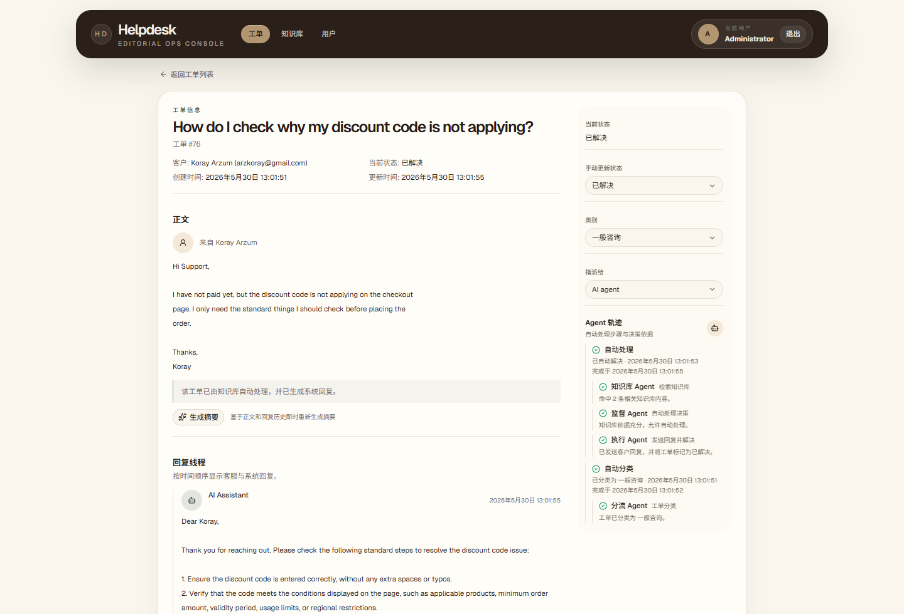
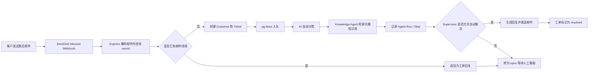

# Governed Agentic Helpdesk Platform

一个面向外贸 To C 售后场景的可治理 Agentic 客服工单平台。系统把客户邮件自动沉淀为工单，支持客服分配、状态流转、邮件回复、AI 分类、AI 摘要、回复润色、RAG 知识库自动解决、Agent 运行轨迹审计和 Dashboard 统计。

系统将 Agent 能力嵌入客服工单流：邮件进入系统后先结构化落库，再通过后台任务触发 Triage Agent 分类、Knowledge Agent 检索、Supervisor Agent 判断是否允许自动解决、Action Agent 发送回复或 Handoff Agent 转人工。每次自动处理都会记录 Agent run 和 step，保证业务流程可追踪、可人工接管、可审计、可测试和可部署。

## 系统截图



这张工单详情页展示了系统的核心闭环：客户邮件被结构化为工单，AI Assistant 基于知识库生成回复并自动解决；右侧保留当前状态、手动状态更新、分类、指派对象和 Agent Trace，便于客服理解自动化决策依据，也能在需要时接管人工处理。

## 项目亮点

- **完整业务闭环**：客户邮件入站 -> 创建/归并工单 -> AI 分类 -> AI 知识库判断 -> 自动回复或转人工 -> Dashboard 统计。
- **权限与账号管理**：基于 Better Auth 数据库会话实现登录认证，通过 RBAC 区分管理员和客服；管理员可创建、编辑、软删除客服账号。
- **邮件工单化**：集成 SendGrid inbound webhook，解析客户邮件、清洗历史引用、处理 Message-ID 幂等和 References 线程归并。
- **Agentic 客服能力**：基于 DeepSeek 和 Vercel AI SDK 实现工单分类、摘要、客服回复润色，以及 pgvector 知识库驱动的自动解决。
- **可审计 Agent Trace**：记录 AgentRun / AgentStep，展示每次自动化处理的检索来源、决策结果、执行动作、错误和人工转交流程。
- **风险治理边界**：退款类工单即使命中知识库，也不会自动发送客户回复，而是转入人工队列并记录审批原因。
- **异步任务队列**：使用 pg-boss 编排 AI 自动分类和自动回复，避免 webhook 请求被大模型调用阻塞。
- **工程化交付**：包含共享 schema、单元/组件测试、E2E 测试、Sentry、Docker、Railway 部署和 Codex GitHub Actions。

## 业务流程



## 架构说明

```text
helpdesk/
├── client/        React + Vite 前端后台
├── server/        Node.js + Express API、认证、AI、邮件、任务队列
├── core/          前后端共享 Zod schema 和 TypeScript 类型
├── playwright/    E2E 测试
├── docs/          Docker / Railway 部署说明
└── .github/       Codex GitHub Actions 工作流
```

### 前端

- React + Vite + TypeScript 构建后台管理界面。
- React Query 管理服务端状态，覆盖用户、工单、详情、统计等数据。
- shadcn/ui + Tailwind CSS 实现后台表格、表单、对话框、状态标识和 Dashboard。
- 前端路由守卫限制未登录用户访问后台页面，管理员路由单独校验角色。

### 后端

- Express 提供 REST API，Prisma 访问 PostgreSQL。
- Better Auth 管理用户、账号和数据库 session。
- SendGrid inbound webhook 负责邮件入站，SendGrid Mail 负责出站回复。
- pg-boss 使用 PostgreSQL 作为任务队列存储，处理 AI 自动分类和自动回复。
- Vercel AI SDK 统一调用 DeepSeek，支持文本生成和结构化 JSON 输出。

### 共享类型与校验

项目使用 `core` workspace 存放共享 Zod schema，例如：

- `core/users.ts`：创建/编辑用户的表单和 API 校验规则。
- `core/email.ts`：工单列表查询、工单更新、分配、回复、邮件入站等 schema。

前端表单和后端接口复用同一套 schema，避免前后端校验规则不一致。

## 核心功能

### 1. 认证与 RBAC

- 管理员和客服使用 Better Auth 登录。
- `/api/tickets` 等业务接口需要有效 session。
- `/api/users` 用户管理接口需要管理员角色。
- 删除客服账号时采用软删除，并自动解除该客服已分配工单，避免工单引用无效账号。

### 2. 邮件入站与工单创建

SendGrid webhook 进入后端后，系统会：

1. 校验 `INBOUND_EMAIL_SECRET`。
2. 解析 multipart 邮件字段。
3. 从 HTML 兜底提取纯文本。
4. 清理邮件历史引用。
5. 根据 `Message-ID` 防重复创建。
6. 根据 `In-Reply-To` / `References` 归并已有工单线程。
7. 新邮件创建为 `Ticket`，并交给 AI 后台任务处理。

### 3. AI 自动处理

AI 能力分为两类：

- **客服辅助**：工单摘要、回复润色、工单分类。
- **自动化处理**：检索 pgvector 知识库，判断是否能自动解决；能解决则生成回复、发送邮件并关闭工单，不能解决则转人工。
- **运行审计与治理**：工单详情页展示 Agent Trace，包括 Triage Agent、Knowledge Agent、Supervisor Agent、Action Agent 和 Handoff Agent 的关键步骤；退款类高风险工单会被强制转人工审批。

### 4. Dashboard 统计

Dashboard 展示：

- 总工单数
- Open 工单数
- AI 自动解决数
- AI 解决率
- 平均解决时间
- 最近 30 天工单趋势

统计逻辑通过 PostgreSQL Stored Function 聚合，Node.js 侧只读取聚合结果，减少全量数据拉取和内存计算压力。

### 5. 测试与部署

- 前端组件测试：Vitest + React Testing Library。
- 端到端测试：Playwright。
- 错误监控：Sentry。
- 本地容器化：Docker Compose。
- 生产部署：Railway。
- AI 协作：Codex GitHub Actions 支持 PR review 和 issue/PR mention 响应。

## 技术栈

| 层级 | 技术 |
|---|---|
| 前端 | React, Vite, TypeScript, React Query, Tailwind CSS, shadcn/ui |
| 后端 | Node.js, Express, TypeScript |
| 数据库 | PostgreSQL, Prisma |
| 认证 | Better Auth, Database Session, RBAC |
| AI / Agent | DeepSeek, Vercel AI SDK, pgvector RAG, AgentRun/AgentStep trace |
| 邮件 | SendGrid Inbound Parse, SendGrid Mail |
| 队列 | pg-boss |
| 测试 | Vitest, React Testing Library, Playwright |
| 部署 | Docker, Railway |
| 监控与协作 | Sentry, GitHub Actions, Codex Action |

## 本地运行

### 方式一：Docker Compose

使用 Docker Compose 启动后端服务和 PostgreSQL 数据库。

```bash
npm run docker:up
```

启动后访问：

```text
http://localhost:4000
```

默认管理员账号：

```text
admin@example.com
qwerdf66
```

停止服务：

```bash
npm run docker:down
```

### 方式二：本地开发

1. 安装依赖：

```bash
npm install
```

2. 准备服务端环境变量：

```bash
copy server\.env.example server\.env
```

3. 配置 `server/.env` 中的数据库、Better Auth、AI 和 SendGrid 变量。

4. 生成 Prisma Client 并执行迁移/seed：

```bash
npm run prisma:generate --workspace server
npm run prisma:migrate --workspace server
npm run prisma:seed --workspace server
```

5. 启动开发环境：

```bash
npm run dev
```

默认端口：

```text
前端: http://localhost:5173
后端: http://localhost:4000
```

## 常用命令

```bash
# 类型检查和构建
npm run typecheck

# 前端组件/单元测试
npm run test --workspace client

# Playwright E2E
npm run playwright:test

# Docker 本地运行
npm run docker:up
```

## 实现说明

该系统面向外贸 To C 售后邮件处理场景，将原本分散在邮箱中的客户咨询抽象为可追踪的工单流程。系统通过邮件线程归并、状态流转、客服分配和回复记录，提升售后问题处理的透明度，也为后续统计 AI 自动化效果提供了结构化数据基础。

AI 能力没有停留在单次问答，而是嵌入到工单生命周期中：新工单入站后进入后台任务队列，先完成自动分类，再基于 Markdown 知识库判断是否可以自动解决。可自动解决的工单会生成客户回复并更新状态；无法确定的问题会回到人工客服队列，避免 AI 在缺少依据时直接处理复杂个案。

工程实现上，项目重点处理了邮件入站的幂等性、邮件线程归并、权限隔离、异步任务、AI 结构化输出、人工兜底和统计聚合等问题。Dashboard 统计通过 PostgreSQL Stored Function 完成聚合计算，Node.js 服务只读取聚合结果，减少应用层全量拉取和内存计算压力。

仓库包含测试、Docker 本地运行、Railway 部署说明、Sentry 错误监控和 GitHub Actions 自动化协作流程。

